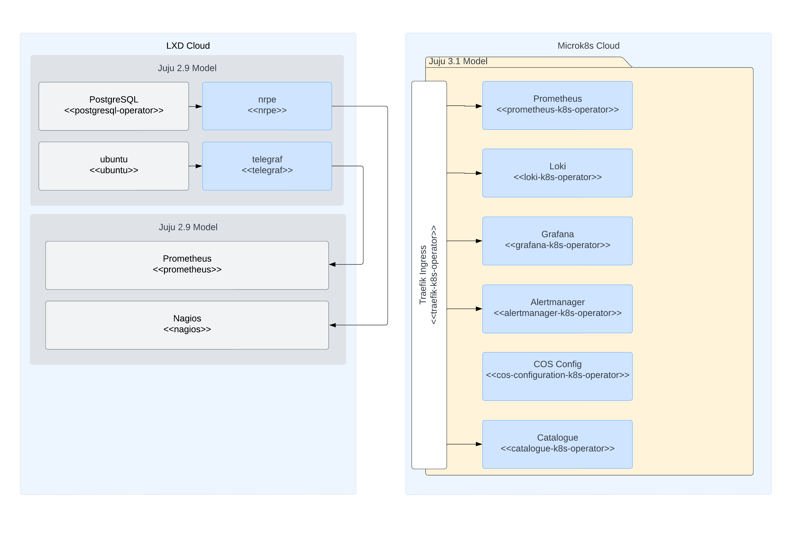
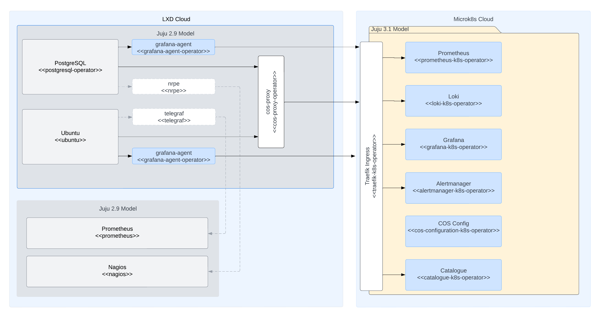

.. _migrate-lma-to-cos-lite:

# Migrate from LMA to COS Lite

Now that COS Lite has been generally available for a while, and we're seeing more and more users wanting to replace their current LMA setup with COS Lite, it feels  like an appropriate time to provide some details on how to accomplish such a migration.

First off, COS Lite is not a new version of LMA, but a completely new product that draws upon the lessons learned from LMA to create a heavily integrated, mainly automated, turn-key observability stack. The flip-side of that is that there isn't any direct, in-place migration path.

This post aims to describe how to, in a way that's as safe as possible, go 
from LMA to COS, but as always with potentially destructive operations 
like these you should make sure you have up-to-date backups before trying 
this.

Let's assume this is our, heavily simplified, existing environment:

## 1. Upgrade your existing Juju controller

As COS requires a Juju version which is equal to, or higher than, `3.1`, 
we first need to upgrade our existing controller to Juju `2.9.44` or newer. 
See the official `Juju docs <https://juju.is/docs/juju/juju-upgrade-controller>`_ on how to perform this upgrade.

The reason why we're picking `2.9.44` (or newer if and when they are released) is because we need a version that is recent enough to include support for cross-controller relations with Juju 3, and then we might as well go to the latest version in the 2.9 track.

## 2. Deploy COS to an isolated Microk8s instance

This model needs to be running Juju 3.1. For instructions on how to deploy 
COS, see  [our tutorial on the topic](https://charmhub.io/topics/canonical-observability-stack/tutorials/install-microk8s).

It will now look somewhat like this:

## 3. Deploy `cos-proxy` and `grafana-agent` in your pre-existing model

Deploy [COS Proxy](https://charmhub.io/cos-proxy) in your existing model and 
wire it up to all the same targets as you would with LMA. cos-proxy is designed 
to bridge the gap between your current LMA enabled charms that utilize filebeat 
and NRPE, and COS, which is utilizing prometheus and loki/promtail. 

For Grafana Agent you only need to relate it to your principal charms.

By now, you will have something that looks a little something like this:

[COS Proxy](https://charmhub.io/cos-proxy) and [Grafana Agent](https://charmhub.io/grafana-agent) will continue to work on 
Juju 2.9 for the time being. This is mainly to support migrations from LMA 
to COS. 

## 4. Evaluate solution parity

You'll now receive your telemetry in both LMA and COS, which is great as it 
allows you to in your own pace evaluate and validate that you have coverage 
for the checks and alarms you're used to in LMA in COS before deciding to 
push the decomission button. 

## 5. Decomission LMA

Now that you have COS Lite up and running and have verified that it works 
even better than what you had with LMA, you can now start decomission your 
LMA setup. 

As it is a migration between solution, none of your historical 
data in LMA will be migrated to COS, so in case this is data you care 
about, you should make sure you keep the backups you did prior to following 
this tutorial until they're no longer relevant.